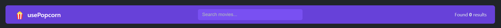
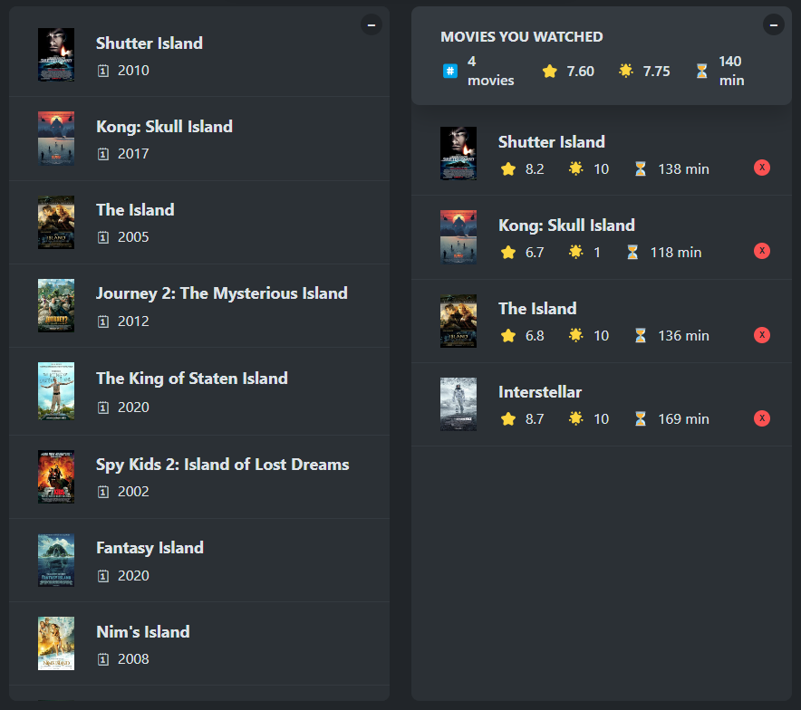

# 🎥 usePopcorn - Movie Watchlist App

🍿

**usePopcorn** is a sleek and modern React-based movie watchlist application that allows users to search for movies, view details, and keep track of the movies they've watched. Leveraging the OMDb API, usePopcorn offers a simple and interactive interface to enhance your movie-watching experience.

## 🌟 Features

- **Search Movies**: Instantly search for movies by title using the OMDb API.
- **View Movie Details**: Access detailed information about each movie, including plot, actors, genre, and more.
- **Watchlist Management**: Add movies to your watched list with a custom user rating.
- **Interactive UI**: Smooth transitions, modals, and animations make for an enjoyable user experience.
- **Keyboard Navigation**: Use the Escape key to easily close movie details.
- **Responsive Design**: Fully responsive for use on desktops, tablets, and mobile devices.

## 🚀 Getting Started

### Prerequisites

Before you begin, ensure you have met the following requirements:

- **Node.js**: Install the latest version of Node.js.
- **NPM**: Install the latest version of NPM.

### Installation

1. **Clone the repository**:

   ```bash
   git clone https://github.com/KarimAdel-1/usePopcorn.git
   cd usePopcorn
   ```

2. **Install dependencies**:

   ```bash
   npm install
   ```

3. **Start the development server**:

   ```bash
   npm start
   ```

4. **Open the app** in your browser at `http://localhost:3000`.

### Environment Variables

To use the OMDb API, you need to set up an API key.

```
http://www.omdbapi.com/?apikey=[yourkey]&s=[query]
```

## 🖼️ Screenshots


_Search for movies and see results instantly._


_View detailed information and add movies to your watchlist._

## 📦 Deployment

To build and deploy the application, run the following command:

```bash
npm run build
```

The build files will be generated in the `build/` directory, which you can then serve using any static hosting service (e.g., Netlify, Vercel, GitHub Pages).

## 🛠️ Built With

- **React** - A JavaScript library for building user interfaces.
- **OMDb API** - The Open Movie Database API used for fetching movie data.
- **CSS** - For styling the components.

## 🤝 Contributing

Contributions, issues, and feature requests are welcome! Feel free to check the [issues page](https://github.com/KarimAdel-1/usePopcorn/issues) and submit a PR.

1. Fork the project.
2. Create your feature branch (`git checkout -b feature/AmazingFeature`).
3. Commit your changes (`git commit -m 'Add some AmazingFeature'`).
4. Push to the branch (`git push origin feature/AmazingFeature`).
5. Open a pull request.

## 💬 Acknowledgments

- Thanks to [OMDb API](http://www.omdbapi.com/) for providing movie data.
